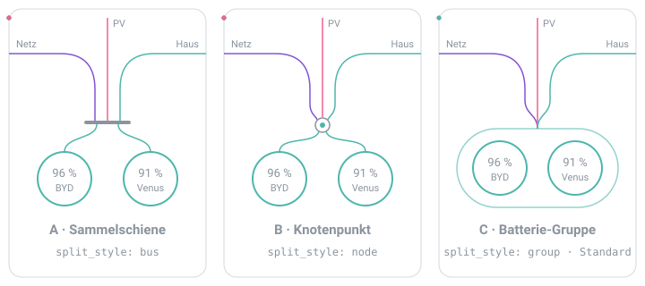

# Power Flow Card Plus – 2 Batterien

Zwei Speicher im Haus sind etwas Schönes: mehr Sonne für den Abend, mehr Ruhe, wenn das Netz mal schwächelt. Nur zeigen die meisten Karten davon genau einen. Dieser Fork der wunderbaren [Power Flow Card Plus](https://github.com/flixlix/flixlix-cards) von flixlix gibt deinem zweiten Akku den Platz, den er verdient – mit eigenem Ladestand, eigener Leistung und Linien, die sich nicht verheddern.

Wie die Linien von Netz, PV und Haus bei deinen beiden Batterien ankommen, suchst du dir selbst aus:

<p align="center">
  
</p>

|       | Variante                                                                                                                      | Im Editor                   | YAML                            |
| ----- | ----------------------------------------------------------------------------------------------------------------------------- | --------------------------- | ------------------------------- |
| **A** | Sammelschiene – die Linien enden auf einem kurzen Balken, zwei Zweige führen zu den Batterien                                 | „Sammelschiene“             | `split_style: bus`              |
| **B** | Knotenpunkt – alles läuft in einen kleinen Ring, der Punkt darin zeigt, ob gerade geladen oder entladen wird                  | „Knotenpunkt“               | `split_style: node`             |
| **C** | Batterie-Gruppe – ein Rahmen fasst beide zu einem Speicher zusammen, die Linien treffen sich wie bei einer einzelnen Batterie | „Rahmen um beide Batterien“ | `split_style: group` (Standard) |

Lieber einen einzigen Kreis? Mit `mode: combined` teilen sich beide Batterien einen Kreis: Leistung zusammengerechnet, Ladestände nebeneinander oder als Mittelwert (`combined_state_of_charge: average`).

Lädt eine Batterie die andere, zählt das nicht als Strom zum Haus oder ins Netz – die Karte rechnet das sauber heraus. Was du bei der ersten Batterie einstellst (etwa nur eine Richtung anzeigen), gilt automatisch auch für die zweite, solange du dort nichts anderes wählst.

Die Karte heißt im Dashboard „Power Flow Card Plus – 2 Batterien“ und hat den eigenen Typ `custom:power-flow-card-plus-2bat`. Sie läuft also friedlich neben dem Original.

```yaml
type: custom:power-flow-card-plus-2bat
entities:
  grid:
    entity: sensor.netz_leistung
  solar:
    entity: sensor.pv_leistung
  battery:
    name: BYD
    entity: sensor.byd_leistung
    state_of_charge: sensor.byd_ladestand
  battery2:
    name: Marstek
    mode: separate
    split_style: group
    entity: sensor.marstek_leistung
    state_of_charge: sensor.marstek_ladestand
```

### Im Editor

Dashboard bearbeiten → Karte hinzufügen → „Power Flow Card Plus – 2 Batterien“. Im Karten-Editor steht direkt unter „Batterie“ der Punkt **„Zweite Batterie“**: Modus wählen (eigener Kreis oder gemeinsamer Kreis), beim eigenen Kreis die Verbindung (A, B oder C), Leistungs-Entität und Ladezustand eintragen, fertig. Es erscheinen immer nur die Optionen, die zum gewählten Modus passen.

Eine bestehende Karte des Originals übernimmst du, indem du im YAML-Editor `type: custom:power-flow-card-plus` in `type: custom:power-flow-card-plus-2bat` änderst.

Alle Optionen: [Second Battery Configuration](packages/flixlix-cards/power-flow-card-plus/README.md#second-battery-configuration).

### Installation

**HACS:** HACS → Benutzerdefinierte Repositories → `https://github.com/Marcels-Custom-Coding/power-flow-card-plus-2bat`, Typ „Dashboard“. Das Original darf installiert bleiben.

**Ohne HACS:** [`dist/power-flow-card-plus-2bat.js`](dist/power-flow-card-plus-2bat.js) nach `/config/www/` kopieren und als Dashboard-Ressource `/local/power-flow-card-plus-2bat.js` (JavaScript-Modul) eintragen.

### Selbst bauen

```bash
corepack pnpm install --filter power-flow-card-plus...
cd packages/flixlix-cards/power-flow-card-plus && corepack pnpm exec rollup -c
cp dist/power-flow-card-plus.js ../../../dist/power-flow-card-plus-2bat.js
```

---

# Flixlix Cards

This is a monorepo for all my Home Assistant cards, including their source code, release management, and documentation.

> [!TIP]
> 📖 **Full documentation lives at [cards.flixlix.com](https://cards.flixlix.com)** — installation, configuration reference, an interactive configurator, and copy-pasteable examples for every card.

## Cards

- **Power Flow Card Plus** — [docs](https://cards.flixlix.com/power-flow-card-plus) · [README](packages/flixlix-cards/power-flow-card-plus/README.md)
- **Energy Flow Card Plus** — [docs](https://cards.flixlix.com/energy-flow-card-plus) · [README](packages/flixlix-cards/energy-flow-card-plus/README.md)
- **Energy Breakdown Card** — [docs](https://cards.flixlix.com/energy-breakdown-card) · [README](packages/flixlix-cards/energy-breakdown-card/README.md)


## Issues and Feature Requests

Have feedback, feature ideas, or encountered a problem? We encourage you to open an issue in this repository.
When submitting, simply select the relevant card so I can assist you more efficiently.
[Open an issue](https://github.com/flixlix/flixlix-cards/issues/new/choose)

## Contributing

Contributions are welcome! Check out the [CONTRIBUTING.md](CONTRIBUTING.md) file for more information, or read the [How to contribute](https://cards.flixlix.com/contributing) guide on the docs site.

## License

This project is released under the [MIT License](LICENSE). You are free to use, fork, modify, and redistribute the cards, including through HACS.
